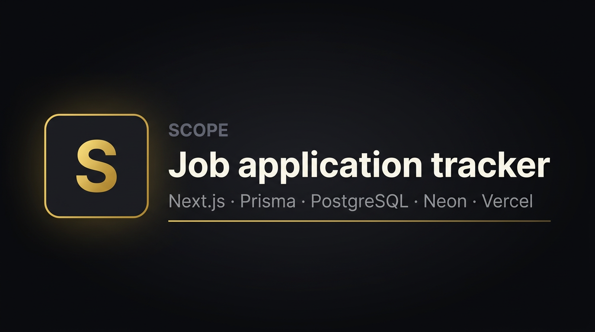

<div align="center">

<a href="https://job-tracker-lr4y4xeum-mastelloneluana6-bytes-projects.vercel.app">
  
</a>

<br/>

### A full-stack tool I built to stay organized while job searching — and to show how I ship real software end-to-end.

[](https://nextjs.org/)
[](https://www.typescriptlang.org/)
[](https://www.prisma.io/)
[](https://www.postgresql.org/)
[](https://tailwindcss.com/)

### [**Open the live app →**](https://job-tracker-lr4y4xeum-mastelloneluana6-bytes-projects.vercel.app)

**[Source code](https://github.com/mastelloneluana6-byte/job-tracker)** · **[Report an issue](https://github.com/mastelloneluana6-byte/job-tracker/issues)** · **[Live demo](https://job-tracker-lr4y4xeum-mastelloneluana6-bytes-projects.vercel.app)**

</div>

---

## At a glance (for recruiters)

| | |
| :--- | :--- |
| **What** | A web app to log applications, track status through the hiring funnel, store listing URLs and notes, and see pipeline stats at a glance. |
| **Why** | Job searching generates a lot of moving parts. I wanted one place for truth — and a **portfolio piece** that reflects how I work: clear UX, typed data layer, and a stack I’d use on a real team. |
| **Proof of skill** | Next.js App Router, **Server Actions** for mutations, **Prisma + PostgreSQL** for persistence, **Tailwind** for a polished responsive UI, **hosted DB** (Neon) + **Vercel** deployment. |
| **Try it** | **[job-tracker on Vercel](https://job-tracker-lr4y4xeum-mastelloneluana6-bytes-projects.vercel.app)** — same UX as production. |

---

## Why I built it

Spreadsheets and scattered browser tabs don’t scale when you’re juggling many roles, companies, and stages. I built **Scope** to:

1. **Reduce cognitive load** — one dashboard: what I applied to, what stage it’s in, when I last updated it.  
2. **Practice full-stack delivery** — not a tutorial clone: real CRUD, real database, real constraints (validation, optimistic flows, production env vars).  
3. **Demonstrate ownership** — product decisions (status model, color-coded pipeline, edit overlay), implementation, and documentation you’re reading now.

This is the kind of problem I like: **messy real-world workflow** → **simple data model** → **interface people can actually use**.

---

## What the app does

- **Capture applications** — company, role, optional job URL, applied date, free-form notes, initial status.  
- **Track the funnel** — statuses from *Wishlist* through *Applied*, *Interviewing*, *Offer*, *Rejected*, and *Withdrawn*, with **color-coded** stats and cards so the pipeline is scannable in seconds.  
- **Update quickly** — change status from the card; **edit** opens a focused overlay for full details; **remove** with confirmation.  
- **Stay oriented** — sidebar shows counts per stage plus how many are still “active” in the search.

**[Open the live app](https://job-tracker-lr4y4xeum-mastelloneluana6-bytes-projects.vercel.app)** to click through the real UI — same patterns I’d bring to a product team: **structured data**, **predictable UI states**, and **server-first** mutations so the UI stays in sync with the database.

---

## Technical highlights

- **Next.js 16 (App Router)** — server-rendered dashboard; dynamic routes and search params for the edit experience.  
- **Server Actions** — create / update / delete / set status without a separate REST layer; `revalidatePath` keeps lists fresh.  
- **Prisma 7 + PostgreSQL** — schema-first `JobApplication` model with enums; **Neon** in production; Prisma Client generated to `src/generated/prisma`.  
- **Neon on Vercel** — `PrismaNeonHttp` + `@neondatabase/serverless` (HTTP/fetch, serverless-friendly); **local / other Postgres** uses `pg` + `@prisma/adapter-pg`.  
- **Tailwind CSS v4** — dark, high-contrast UI with consistent spacing, accessible forms, and status-driven accent colors.  
- **TypeScript throughout** — shared types from Prisma; fewer “stringly typed” bugs across UI and data access.

---

## Tech stack

| Layer | Choice |
|--------|--------|
| Framework | Next.js 16 — App Router, React 19 |
| API surface | Server Actions (no hand-rolled REST for core CRUD) |
| Language | TypeScript |
| Styling | Tailwind CSS v4 |
| Data | Prisma 7 · PostgreSQL — Neon (`*.neon.tech`) uses `PrismaNeonHttp` (fetch); other URLs use `pg` |
| Hosting (typical) | [Vercel](https://vercel.com/) (app) · [Neon](https://neon.tech/) (database) |

---

## Project layout

```
src/app/              # Pages, layout, server actions
src/components/       # Tracker UI (forms, cards, stats, status controls)
src/lib/              # Prisma singleton for server usage
prisma/               # Schema & migrations
docs/                 # README assets (banner, screenshots)
```

---

## Run it locally

**Requirements:** Node.js 20+ and a PostgreSQL `DATABASE_URL` (local or [Neon](https://neon.tech/)).

```bash
git clone https://github.com/mastelloneluana6-byte/job-tracker.git
cd job-tracker
npm install
cp .env.example .env   # then set DATABASE_URL
npm run db:push        # or npm run db:migrate
npm run dev
```

Then open the local URL shown in your terminal after `npm run dev`.

**Public build (no local setup):** **[https://job-tracker-lr4y4xeum-mastelloneluana6-bytes-projects.vercel.app](https://job-tracker-lr4y4xeum-mastelloneluana6-bytes-projects.vercel.app)**

**Useful scripts:** `npm run build` · `npm run db:studio` · `npm run db:generate`

---

## Deploy (e.g. Vercel)

1. Import this repo into [Vercel](https://vercel.com/).  
2. Set **`DATABASE_URL`** in **Project → Settings → Environment Variables**. Use the same Neon URL as in your local `.env`.  
   - **Key** must be exactly `DATABASE_URL` (letters + underscore only).  
   - **Value** is the full `postgresql://…` string.  
   - Enable for **Production**, **Preview**, and **Development** as needed.  
3. Redeploy (**Deployments → … → Redeploy** or push a new commit).

**Live app:** **[https://job-tracker-lr4y4xeum-mastelloneluana6-bytes-projects.vercel.app](https://job-tracker-lr4y4xeum-mastelloneluana6-bytes-projects.vercel.app)**

**Note:** There is **no login** yet — the demo is intentionally simple. Data is as public as the URL you share. Next iteration would be auth (e.g. NextAuth or Clerk) and row-level ownership.

---

## What I’d build next

- **Authentication** and per-user data  
- **Search / filters** (company, date range, status)  
- **Reminders** or follow-up dates  
- **CSV export** for backups

---

## Screenshot

Add `docs/screenshot.png` and uncomment below if you want an app screenshot next to the banner:

```markdown

```

---

## Contact

If you’re hiring and this project resonates, reach out via the contact options on **[my GitHub profile](https://github.com/mastelloneluana6-byte)** — I’m happy to walk through architecture, trade-offs, or how I’d extend this on a team.

---

*Built as a portfolio project — Scope is the product name in the UI; the repository is `job-tracker`.*
